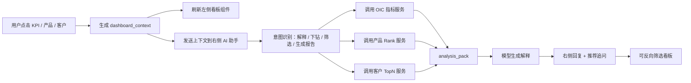

# OIC 维度经营看板与对话框联动设计说明

## 1. 设计目标

本方案面向 OIC 维度经营分析，在现有 MAVA 对话框基础上扩展一个可点击、可下钻、可与 AI 助手联动的经营看板。

OIC 看板与 MO 管理层驾驶舱可共用同一套交互逻辑，但展示维度不同：

- MO 管理层：全行/部门/条线视角，第二行侧重部门/条线 Rank。
- OIC 维度：客户经理/管户视角，第二行侧重产品 Rank，第三行侧重客户 TopN。

顶部只保留四个核心指标：

1. 存款
2. 贷款
3. 低息存款
4. 非息收入

暂不放“利息收入”，原因是 FTP 口径暂无法稳定按月体现，容易造成管理口径和展示口径不一致。

## 2. Demo 图文件

本文件夹已生成四个点击态：

- `01_OIC看板_存款点击态.png`
- `02_OIC看板_贷款点击态.png`
- `03_OIC看板_低息存款点击态.png`
- `04_OIC看板_非息收入点击态.png`

同时保留了可继续修改的 HTML 原稿：

- `oic_dashboard_demo.html`

以及用于生成 PNG 的脚本：

- `generate_oic_dashboard_images.py`

## 3. 页面结构

建议采用“左侧看板 + 右侧 AI 助手”的结构，但视觉上继续沿用现有 MAVA 对话框风格，避免做成一个完全割裂的新系统。

页面分为三块：

1. 顶部筛选区
   - 日期
   - OIC / EE 编号
   - 币种
   - 数据更新时间

2. 左侧 OIC 看板
   - 第一行：四个 KPI 卡片
   - 第二行：30 天趋势、按月趋势、产品贡献 Rank
   - 第三行：客户 Top20 贡献

3. 右侧 AI 分析助手
   - 当前上下文
   - 自动分析摘要
   - 推荐追问
   - 自然语言输入框
   - 筛选看板 / 生成报告 / 附加明细按钮

## 4. 四个核心指标点击后的刷新逻辑

第一行 KPI 是整个看板的主控制器。用户点击某个指标后，第二行和第三行全部跟随刷新。

### 4.1 点击“存款”

第二行：

- 存款最近 30 天趋势
- 存款按月趋势
- 存款产品贡献 Rank

产品 Rank 建议包括：

- 定期存款 - 非 CMB 分润
- 活期存款 - 非员工
- 储蓄存款
- 发行存款证
- 定期存款 - CMB 分润
- 活期存款 - 员工

第三行：

- 客户按存款贡献 Top20
- 展示余额、较上月、增幅、占比

### 4.2 点击“贷款”

第二行：

- 贷款最近 30 天趋势
- 贷款按月趋势
- 贷款产品贡献 Rank

产品 Rank 可来自已有映射表中的资产类贷款产品：

- 房产按揭贷款
- 房产按揭贷款 - 员工
- 个人贷款
- 税务贷款
- 透支
- 定期循环贷款
- 银团贷款
- 贸易融资
- 支票贴现
- 租赁贷款
- 信用卡贷款
- 保理
- 新股认购/保证金贷款
- 其他贷款
- 不良贷款

第三行：

- 客户按贷款贡献 Top20
- 支持点击客户进入客户画像和风险/收益贡献解释

### 4.3 点击“低息存款”

第二行：

- 低息存款最近 30 天趋势
- 低息存款按月趋势
- 低息存款产品贡献 Rank

产品 Rank 建议包括：

- 活期存款 - 非员工
- 活期存款 - 员工
- 储蓄存款

第三行：

- 客户按低息存款贡献 Top20
- 重点展示低息资金稳定性、较上月变化、占低息存款比重

### 4.4 点击“非息收入”

第二行：

- 非息收入最近 30 天趋势
- 非息收入按月趋势
- 非息收入来源 Rank

产品/来源 Rank 可来自损益映射表：

- 中间业务净收入
- 收费及佣金收入
- 收费及佣金支出抵减
- 财资业务净收入
- 交易业务净收入
- 以 FVPL 入账金融资产及负债之净收益

第三行：

- 客户按非息收入贡献 Top20
- 可进一步拆分为一次性收入、持续性收入、交易类收入等口径

## 5. 看板与对话框的联动机制

核心是维护一个共享的 `dashboard_context`。

用户每次点击 KPI、趋势点、产品行、客户行时，前端都生成一个上下文对象，并发送给右侧 AI 助手。

示例：

```json
{
  "module": "OIC_DASHBOARD",
  "date": "2026-05-05",
  "oic_id": "EE001408023",
  "scope": "OIC",
  "metric_code": "LOAN_BAL",
  "metric_name": "贷款",
  "selected_visual": "kpi_card",
  "time_granularity": ["daily", "monthly"],
  "compare_basis": ["D-1", "M-1", "YTD", "YOY"],
  "product_code": null,
  "product_name": null,
  "ci_id": null,
  "customer_name": null,
  "filters": {
    "currency": "ALL",
    "customer_type": "ALL",
    "industry": "ALL"
  }
}
```

如果用户点击第二行产品 Rank 中的“贸易融资”，上下文变为：

```json
{
  "module": "OIC_DASHBOARD",
  "date": "2026-05-05",
  "oic_id": "EE001408023",
  "scope": "OIC",
  "metric_code": "LOAN_BAL",
  "metric_name": "贷款",
  "selected_visual": "product_rank",
  "product_code": "MA_M111_8",
  "product_name": "贸易融资",
  "ci_id": null,
  "customer_name": null
}
```

如果用户点击第三行某客户，上下文变为：

```json
{
  "module": "OIC_DASHBOARD",
  "date": "2026-05-05",
  "oic_id": "EE001408023",
  "scope": "OIC",
  "metric_code": "LOAN_BAL",
  "metric_name": "贷款",
  "selected_visual": "customer_top20",
  "product_code": "MA_M111_8",
  "product_name": "贸易融资",
  "ci_id": "CI000123456",
  "customer_name": "Pacific Trade Finance Ltd."
}
```

右侧 AI 助手回答时必须优先读取这个上下文，而不是重新猜用户在问什么。

## 6. 推荐工具/API 设计

不建议让模型直接查数据库或拼 SQL。建议通过固定分析工具获取结构化结果。

### 6.1 看板总览

```json
{
  "tool": "get_oic_dashboard_overview",
  "params": {
    "date": "2026-05-05",
    "oic_id": "EE001408023",
    "metrics": ["DEP_BAL", "LOAN_BAL", "LOW_COST_DEP", "NON_INTEREST_INCOME"]
  }
}
```

返回：

- 四个 KPI 卡片值
- 较昨日
- 较上月
- 较年初
- 同比或年初以来增幅

### 6.2 指标趋势

```json
{
  "tool": "get_oic_metric_trend",
  "params": {
    "date": "2026-05-05",
    "oic_id": "EE001408023",
    "metric_code": "LOAN_BAL",
    "granularity": "daily",
    "window": 30
  }
}
```

用于第二行左侧 30 天趋势。

### 6.3 按月趋势

```json
{
  "tool": "get_oic_metric_monthly_trend",
  "params": {
    "date": "2026-05-05",
    "oic_id": "EE001408023",
    "metric_code": "LOAN_BAL",
    "months": 12
  }
}
```

用于第二行中间的按月趋势。

### 6.4 产品贡献 Rank

```json
{
  "tool": "get_oic_product_rank",
  "params": {
    "date": "2026-05-05",
    "oic_id": "EE001408023",
    "metric_code": "LOAN_BAL",
    "rank_by": "mtd_change",
    "top_n": 10
  }
}
```

用于第二行右侧产品 Rank。

### 6.5 客户 TopN

```json
{
  "tool": "get_oic_customer_topn",
  "params": {
    "date": "2026-05-05",
    "oic_id": "EE001408023",
    "metric_code": "LOAN_BAL",
    "product_code": "MA_M111_8",
    "rank_by": "balance",
    "top_n": 20
  }
}
```

用于第三行客户贡献。

### 6.6 生成 OIC 摘要

```json
{
  "tool": "build_oic_analysis_pack",
  "params": {
    "date": "2026-05-05",
    "oic_id": "EE001408023",
    "metric_code": "LOAN_BAL",
    "include": ["overview", "trend", "product_rank", "customer_top20", "alerts"]
  }
}
```

用于右侧 AI 助手生成文字分析，也可传给生成报告模块。

## 7. 与现有三模块的关系

建议新增一个入口：“OIC 经营看板”或“经营驾驶舱”，而不是把它强塞进“查询数据”或“生成报告”。

四个模块的关系可以这样划分：

- 查询数据：用户主动问一个指标或一组指标，系统返回数据表和简短解释。
- 生成报告：用户指定 OIC/时间后，系统生成固定格式经营分析报告。
- 知识问答：制度、口径、市场信息、系统操作等。
- OIC 经营看板：用户通过点击和追问进行探索式经营分析。

其中 OIC 经营看板与生成报告共享同一个 `analysis_pack`：

```json
{
  "overview": {},
  "kpi_cards": [],
  "trend_series": [],
  "monthly_series": [],
  "product_rank": [],
  "customer_top20": [],
  "anomaly_flags": [],
  "suggested_questions": []
}
```

看板用于实时探索，生成报告用于固化输出。

## 8. 对话框推荐追问设计

根据当前上下文动态生成推荐追问。

点击“存款”后：

- 存款增长主要由哪些产品拉动？
- 哪些客户贡献了本月存款增量？
- 当前低息存款占比是否改善？
- 生成本月存款经营摘要。

点击“贷款”后：

- 贷款下降主要由哪些产品拖累？
- 哪些客户贷款余额变化最大？
- 房产按揭和贸易融资分别贡献多少？
- 生成贷款异动分析。

点击“低息存款”后：

- 低息存款增长是否稳定？
- 活期非员工账户贡献了多少？
- 哪些客户低息资金流入最大？
- 生成低息存款提升建议。

点击“非息收入”后：

- 非息收入增长来自哪些来源？
- 哪些客户贡献了主要非息收入？
- 收费及佣金收入是否可持续？
- 生成非息收入分析摘要。

## 9. 实现流程



## 10. 数据表建议

### 10.1 OIC 日频指标表

`fact_oic_daily_metric`

字段建议：

- date
- oic_id
- metric_code
- value
- dtd_change
- mtd_change
- ytd_change
- yoy_change
- currency
- update_time

### 10.2 OIC 产品贡献表

`fact_oic_product_contribution`

字段建议：

- date
- oic_id
- metric_code
- product_code
- product_name
- value
- dtd_change
- mtd_change
- ytd_change
- contribution_ratio
- rank_no

### 10.3 OIC 客户贡献表

`fact_oic_customer_contribution`

字段建议：

- date
- oic_id
- ci_id
- customer_name
- customer_type
- industry
- metric_code
- product_code
- value
- dtd_change
- mtd_change
- ytd_change
- contribution_ratio
- rank_no

### 10.4 指标注册表

`dim_metric_registry`

字段建议：

- metric_code
- metric_name
- metric_group
- unit
- source_table
- default_compare_basis
- positive_direction
- default_rank_by
- default_granularity
- display_order

## 11. 权限和审计

OIC 维度会展示客户 Top20，因此权限要比普通指标看板更严格。

建议：

1. 默认只能查看本人 OIC 管户客户。
2. 上级管理者查看下属 OIC 时，需要按组织权限控制。
3. 客户名称、CI 编号、余额、收入贡献应记录访问审计。
4. 导出和生成报告应记录操作人、时间、筛选条件和导出内容范围。
5. 若进入演示环境，可对客户名称脱敏。

## 12. MVP 建议

第一期建议只做以下能力：

1. 四个 KPI 卡片点击联动。
2. 第二行三块：30 天趋势、按月趋势、产品 Rank。
3. 第三行客户 Top20。
4. 右侧助手读取 `dashboard_context`，支持四类追问：
   - 分析变动原因
   - 查看产品 Rank
   - 查看 Top20 客户
   - 生成 OIC 摘要
5. 生成报告模块复用当前 `analysis_pack`，不要另起一套报告取数逻辑。

这样能最快形成闭环：看板发现问题，对话解释问题，报告固化结论。
