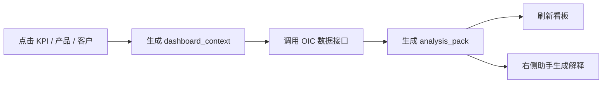
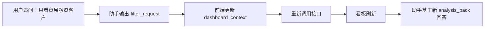

# OIC 看板交互 Demo 与落地说明 v2

## 1. 本次交付

本次在原静态 OIC 看板方案基础上，新增一个可直接打开、可点击体验的 HTML Demo：

- `oic_dashboard_interactive_demo.html`

这个 Demo 不依赖后端服务，目的是让业务、前端和工作流配置同事快速对齐“看板与对话框怎么联动”。已经实现的交互包括：

1. 点击顶部四个 OIC 指标卡：存款、贷款、低息存款、非息收入。
2. 第二行自动切换为当前指标的 30 天趋势、按月趋势、产品 Rank。
3. 第三行自动切换为当前指标的客户 Top20 贡献。
4. 点击产品 Rank 行后，客户 Top20 与右侧对话框进入该产品上下文。
5. 点击客户行后，右侧对话框进入客户贡献上下文。
6. 右侧推荐分析按钮可切换“分析变动原因、查看产品 Rank、查看 Top20 客户、生成 OIC 摘要”。
7. 底部输入框可模拟自然语言追问，例如“生成报告”“看客户”“哪个产品拖累”。
8. 右下角“筛选看板、生成报告、附加明细”按钮有基础响应，便于演示双向联动。

Demo 中的数据是前端模拟数据，字段命名和产品层级尽量贴近当前项目已有映射，正式落地时应替换为 MMP/OIC 接口返回值。

## 2. 参考到的行业做法

这类产品现在主流方向不是“聊天框单独回答”，而是“仪表盘作为结构化上下文，助手负责解释和下一步动作”。可以参考：

- [Microsoft Power BI Copilot](https://learn.microsoft.com/en-us/power-bi/create-reports/copilot-introduction)：强调在报表、视觉对象和语义模型上下文中生成摘要和解释。
- [Microsoft Fabric / Power BI Copilot 概览](https://learn.microsoft.com/en-us/fabric/get-started/copilot-power-bi-overview)：将 Copilot 放在已有 BI 资产旁边，辅助生成洞察、叙述和页面内容。
- [Tableau Pulse](https://www.tableau.com/products/tableau-pulse)：以指标为中心推送洞察，并支持围绕指标继续追问。
- [ThoughtSpot Spotter](https://www.thoughtspot.com/product/spotter)：偏“自然语言 + 指标语义层 + 可追溯分析”的交互，适合作为问数和看板联动参考。

对本项目最有价值的抽象是三点：指标要有语义层，点击行为要变成上下文对象，模型只解释已经被脚本和接口确认过的事实。

## 3. 总体设计方向

OIC 看板建议沿用当前 MAVA AI 助手已有界面，而不是另起一个完全不同的驾驶舱。这样管理层不用在“看板系统”和“助手系统”之间切换，用户体验更顺。

页面结构建议固定为：

- 左侧：沿用现有导航栏和功能入口。
- 中间：OIC 经营看板，第一行是四个指标卡，第二行是趋势和产品贡献，第三行是客户贡献。
- 右侧：AI 助手，展示当前上下文、解释结果、推荐动作和自然语言追问。

第一行只放四个指标：存款、贷款、低息存款、非息收入。利息收入暂不放入首屏主指标，因为当前 FTP 口径暂无法按月稳定体现，放进去容易让管理层追问时产生口径争议。

## 4. 与现有脚本和提示词的衔接

当前项目已经有三条成熟链路：

- 问数模块：参数识别、脚本取数、数据切片、回答专家。
- 生成报告模块：数据预处理、报告分析师提示词、报告组装。
- 知识问答模块：查询改写、联网/知识库检索、证据融合、合成生成。

OIC 看板不建议再做一套孤立逻辑，而应该把“点击看板”当成一种更稳定的问数入口。自然语言入口需要模型解析参数，点击入口不需要，因为日期、OIC、指标、产品、客户都已经在界面上确定。

推荐分工：

- 看板点击负责产生 `dashboard_context`。
- 脚本负责按 `dashboard_context` 取数、切片、排序、计算差异。
- 模型负责把 `analysis_pack` 解释成管理层能读的文字。
- 生成报告模块复用同一个 `analysis_pack`，不要重新计算。
- 知识问答模块只在用户问制度、口径、市场背景时介入。

## 5. 核心上下文对象

看板与对话框之间需要一个统一对象，建议命名为 `dashboard_context`。

```json
{
  "module": "OIC_DASHBOARD",
  "event_type": "KPI_CLICK",
  "date": "2026-05-05",
  "oic_id": "EE001408023",
  "oic_name": "示例 OIC",
  "metric_code": "LOAN_BAL",
  "metric_name": "贷款",
  "selected_visual": "kpi_card",
  "time_granularity": ["daily", "monthly"],
  "compare_basis": ["prev_day", "mtd", "ytd"],
  "product_code": null,
  "product_name": null,
  "ci_id": null,
  "customer_name": null,
  "filters": {
    "currency": "HKD",
    "customer_type": "ALL",
    "industry": "ALL"
  }
}
```

点击 KPI 时，`metric_code` 变化；点击产品 Rank 时，补充 `product_code/product_name`；点击客户 Top20 时，补充 `ci_id/customer_name`。右侧助手永远读取这个对象，不要靠模型猜“用户刚才点了哪里”。

## 6. 四个指标的展示逻辑

四个指标共用同一套页面骨架，只切换指标口径和产品映射。

| 指标 | 指标代码建议 | 第二行 | 第三行 |
| --- | --- | --- | --- |
| 存款 | `DEP_BAL` | 30天趋势、按月趋势、存款产品 Rank | 客户按存款贡献 Top20 |
| 贷款 | `LOAN_BAL` | 30天趋势、按月趋势、贷款产品 Rank | 客户按贷款贡献 Top20 |
| 低息存款 | `LOW_COST_DEP` | 30天趋势、按月趋势、低息产品 Rank | 客户按低息存款贡献 Top20 |
| 非息收入 | `NON_INTEREST_INCOME` | 30天趋势、按月趋势、非息收入产品 Rank | 客户按非息收入贡献 Top20 |

产品 Rank 不按部门排，而按产品排，这一点与 MO 管理层条线看板不同。OIC 维度更适合回答“这个客户经理/组合到底靠哪些产品贡献”，而不是回答“哪个部门贡献最大”。

## 7. 产品映射建议

结合当前项目里的映射表，OIC 看板可以先沉淀一张统一产品映射表，避免前端、问数脚本、报告脚本各写一套口径。

建议表名：`dim_metric_product_mapping`

核心字段：

```text
metric_code
metric_name
product_code
product_name
product_level_1
product_level_2
source_subject
is_low_cost
sort_order
is_active
```

贷款产品可覆盖：房产按揭贷款、个人贷款、税务贷款、透支、定期循环贷款、银团贷款、贸易融资、支票贴现、租赁贷款、信用卡贷款、保理、新股认购/保证金贷款、其他贷款、不良贷款。

存款和低息存款可覆盖：活期存款、储蓄存款、定期存款、发行存款证，并用 `is_low_cost` 标识哪些进入低息存款。

非息收入可覆盖：中间业务净收入、收费及佣金收入、收费及佣金支出、财资业务净收入、交易业务净收入、FVPL 金融资产及负债净收益。

## 8. 后端接口建议

不建议让助手直接拼 SQL。看板应该有稳定 API 或工作流节点。

```json
{
  "tool": "get_oic_dashboard_overview",
  "params": {
    "date": "2026-05-05",
    "oic_id": "EE001408023",
    "metrics": ["DEP_BAL", "LOAN_BAL", "LOW_COST_DEP", "NON_INTEREST_INCOME"]
  }
}
```

```json
{
  "tool": "get_oic_metric_daily_trend",
  "params": {
    "date": "2026-05-05",
    "oic_id": "EE001408023",
    "metric_code": "LOAN_BAL",
    "window": 30
  }
}
```

```json
{
  "tool": "get_oic_product_rank",
  "params": {
    "date": "2026-05-05",
    "oic_id": "EE001408023",
    "metric_code": "LOAN_BAL",
    "rank_by": "mtd_change",
    "top_n": 10
  }
}
```

```json
{
  "tool": "get_oic_customer_topn",
  "params": {
    "date": "2026-05-05",
    "oic_id": "EE001408023",
    "metric_code": "LOAN_BAL",
    "product_code": "MA_M111_8",
    "rank_by": "balance",
    "top_n": 20
  }
}
```

```json
{
  "tool": "build_oic_analysis_pack",
  "params": {
    "date": "2026-05-05",
    "oic_id": "EE001408023",
    "metric_code": "LOAN_BAL",
    "product_code": "MA_M111_8",
    "ci_id": null,
    "include": ["overview", "daily_trend", "monthly_trend", "product_rank", "customer_top20", "alerts"]
  }
}
```

## 9. `analysis_pack` 建议格式

模型侧最顺滑的输入不是一堆表格，而是一份已经归纳好的分析包。

```json
{
  "context": {
    "date": "2026-05-05",
    "oic_id": "EE001408023",
    "metric_code": "LOAN_BAL",
    "metric_name": "贷款",
    "product_code": "MA_M111_8",
    "product_name": "贸易融资",
    "ci_id": null
  },
  "kpi": {
    "value": 59.92,
    "unit": "亿港元",
    "daily_change": -0.11,
    "mtd_change": -0.92,
    "ytd_change": 4.41
  },
  "drivers": [
    {
      "type": "product",
      "name": "贸易融资",
      "contribution": -0.58,
      "reason_hint": "较上月回落，是本月贷款下降的主要拖累项"
    }
  ],
  "product_rank": [],
  "customer_top20": [],
  "quality_notes": [
    "所有金额单位为亿港元",
    "增幅按上月末或年初口径计算",
    "FTP 暂不纳入首屏主指标"
  ]
}
```

这样报告模块和对话框都可以复用同一份材料。对话框用于即时解释，报告模块用于沉淀正式文字。

## 10. 提示词方向

右侧助手提示词建议保持短而硬，避免把模型变成取数工具。

```text
你是工银亚洲 OIC 经营分析助手。
你只能基于 dashboard_context 和 analysis_pack 回答。
数值、排名、同比、环比、客户贡献必须来自 analysis_pack，不得自行计算或编造。
如果用户追问的是当前看板上下文内的问题，优先解释现有分析包。
如果用户要求切换指标、产品、客户或日期，输出 filter_request，由看板刷新后再回答。
如果用户要求制度、定义、口径解释，转入知识问答模块。
如果用户要求形成正式材料，调用生成报告模块并传入当前 analysis_pack。
回答面向管理层，先结论，后原因，再给下一步建议。
```

这与此前知识问答 v10.2 的思路一致：模型少做结构化解析，多做表达；确定性逻辑交给脚本。

## 11. 与对话框的双向联动

正向联动：看板点击影响对话框。



反向联动：对话框影响看板。



重点是：助手不直接改页面，也不直接算数；助手输出结构化意图，由前端和脚本执行。

## 12. 分阶段落地建议

第一阶段先做“可用闭环”：

- 四个 KPI 可点击。
- KPI 点击刷新第二行和第三行。
- 产品 Rank 可点击并过滤客户 Top20。
- 客户 Top20 可点击并更新右侧上下文。
- 右侧助手能基于当前上下文生成一句结论、三条原因和两个建议问题。

第二阶段再做“智能增强”：

- 支持对话框反向筛选日期、产品、客户类型、行业。
- 加入异常识别，例如连续下跌、单一客户贡献过高、产品拖累项。
- 接入生成报告模块，点击“生成 OIC 摘要”自动形成报告段落。

第三阶段做“管理层体验”：

- 增加收藏视图和常用组合。
- 增加权限控制和敏感客户脱敏。
- 增加口径说明和数据更新时间提示。
- 对接移动端或大屏模式。

## 13. 当前 Demo 与正式开发的差异

当前 HTML Demo 的作用是说明交互，不代表正式前端架构。正式开发时需要替换：

- 前端模拟数据替换为真实 MMP/OIC 接口。
- 内置产品映射替换为统一映射表。
- 简单 JS 状态替换为工作流上下文或前端状态管理。
- 模拟对话替换为真实模型调用。
- 静态客户名替换为 CI 维度客户贡献明细。

但页面结构、点击链路、上下文对象和 `analysis_pack` 格式可以直接作为开发蓝本。

## 14. 我建议的最终方向

OIC 看板不要做成一个“更多图表的页面”，而要做成一个“可对话的经营分析入口”。管理层看到异常后，第一反应通常不是再换一个图，而是问：

- 为什么涨/跌？
- 哪个产品贡献最大？
- 哪些客户带动或拖累？
- 是否可持续？
- 能不能形成一段报告文字？

所以设计的核心不是堆满图，而是让每一次点击都把问题带到下一层：指标到产品，产品到客户，客户到解释，解释到报告。这条链路打通后，OIC 看板、问数模块和生成报告模块就能真正形成一个产品，而不是三个并列入口。
