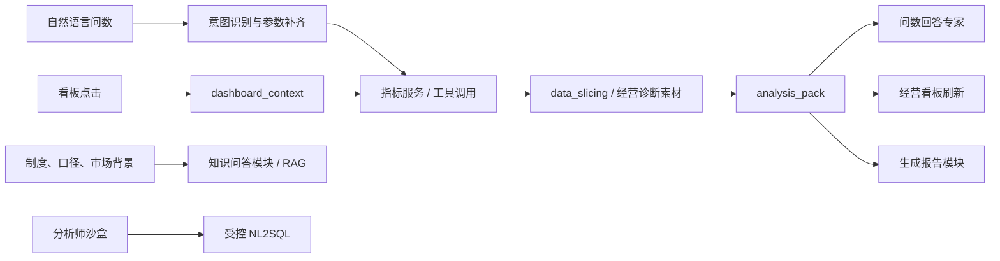

# MAVA AI 问数助手与经营看板架构迭代方案

日期：2026-05-10

## 1. 迭代判断

当前 MAVA AI 已经形成三条主链路：数据查询模块、生成报告模块、知识问答模块。后续经营看板不建议另起一套独立逻辑，而应作为“可点击的问数入口”接入同一套指标服务、数据切片和报告生成能力。

核心判断：

- 客户经理和 MO 管理层主入口优先采用“指标 API / 脚本预计算 / 模型解释”的路线。
- NL2SQL 暂不作为生产主入口，可保留为分析师沙盒能力。
- 看板点击、自然语言追问、报告生成都应沉淀为统一上下文和统一分析包。

## 2. 目标架构



这条链路的分工是：模型负责理解和表达，接口与脚本负责事实、计算、权限和口径。

## 3. 四类入口

| 入口 | 典型问题 | 处理模块 | 输出 |
| --- | --- | --- | --- |
| `query_metric` | 贷款较上月变化如何 | 数据查询模块 | 数据表、经营分析、推荐追问 |
| `dashboard_action` | 点击贷款卡、贸易融资行、客户行 | 经营看板链路 | 看板刷新、上下文解释、filter_request |
| `generate_report` | 生成 OIC 月度摘要 | 生成报告模块 | 正式经营报告段落 |
| `explain_metric` | 低息存款口径是什么 | 知识问答模块 | 口径解释、制度说明、来源依据 |

## 4. 统一上下文：`dashboard_context`

看板侧所有点击都要显式生成上下文对象。右侧 AI 助手只读取上下文，不猜用户刚才点了哪里。

```json
{
  "module": "OIC_DASHBOARD",
  "event_type": "PRODUCT_CLICK",
  "date": "2026-05-05",
  "scope": "OIC",
  "oic_id": "EE001408023",
  "metric_code": "LOAN_BAL",
  "metric_name": "贷款",
  "selected_visual": "product_rank",
  "product_code": "MA_M111_8",
  "product_name": "贸易融资",
  "ci_id": null,
  "customer_name": null,
  "filters": {
    "currency": "HKD",
    "customer_type": "ALL",
    "industry": "ALL"
  }
}
```

点击层级建议固定为：

1. KPI 卡片：确定指标。
2. 产品 Rank：补充产品上下文，并刷新客户 TopN。
3. 客户 TopN：补充客户上下文，并触发客户贡献解释。
4. 自然语言追问：输出 `filter_request` 或触发生成报告。

## 5. 统一分析包：`analysis_pack`

数据查询、看板和报告应共用一份分析包，减少重复取数和重复解释。

```json
{
  "context": {},
  "kpi": {},
  "trend": [],
  "monthly_trend": [],
  "drivers": [],
  "product_rank": [],
  "customer_topn": [],
  "anomaly_flags": [],
  "evidence": [],
  "quality_notes": [],
  "recommended_questions": []
}
```

建议规则：

- 数字、排名、同比、环比、客户贡献只来自 `analysis_pack`。
- 模型生成的每条经营判断尽量绑定 `evidence`。
- 报告模块优先消费 `analysis_pack`，不要重新取数。
- 看板侧只输出短分析，长文本进入生成报告模块。

## 6. 指标语义层

建议将 `dim_metric_registry` 提升为系统核心资产。

| 字段 | 说明 |
| --- | --- |
| `metric_code` | 指标唯一编码 |
| `metric_name` | 指标中文名 |
| `metric_group` | Assets / Liabilities / Revenue / Customer |
| `unit` | 元、万元、亿元、% |
| `source_api` | 来源接口 |
| `default_compare_basis` | 较上月、较上年末、累计同比等 |
| `positive_direction` | 越高越好 / 越低越好 / 中性 |
| `permission_level` | OIC / Team / Dept / CI |
| `caveat` | 口径提示，如 FTP 暂不进入首屏 |

产品映射建议沉淀为 `dim_metric_product_mapping`，用于统一看板、问数、报告中的产品口径。

## 7. 看板 MVP 范围

首屏保留四个指标：

- 存款：`DEP_BAL`
- 贷款：`LOAN_BAL`
- 低息存款：`LOW_COST_DEP`
- 非息收入：`NON_INTEREST_INCOME`

暂不把利息收入放入首屏，原因是 FTP 口径按月稳定性不足，容易引起管理口径争议。

MVP 交付闭环：

1. 四个 KPI 卡片可点击。
2. 第二行联动 30 天趋势、按月趋势、产品 Rank。
3. 第三行联动客户 TopN。
4. 右侧助手读取 `dashboard_context` 和 `analysis_pack`。
5. 推荐动作支持“分析变动原因、查看产品 Rank、查看 Top20 客户、生成 OIC 摘要”。
6. 生成报告模块复用当前分析包。

## 8. 权限与审计

客户 TopN 属于敏感经营明细，需要前置权限和审计。

- 默认只展示本人或授权范围内 OIC。
- 上级查看下属 OIC 时按组织权限校验。
- 客户名称、CI 编号、余额、收入贡献记录访问审计。
- 导出、附加明细、生成报告记录操作人、时间、筛选条件和内容范围。
- 演示环境可使用脱敏客户名称。

## 9. 分阶段路线

| 阶段 | 目标 | 交付 |
| --- | --- | --- |
| MVP | 看板可点击、助手可解释 | 四 KPI、产品 Rank、客户 TopN、`dashboard_context`、`analysis_pack` |
| 第二阶段 | 对话反向筛选、报告复用 | `filter_request`、报告生成、异常识别 |
| 第三阶段 | MO 管理层驾驶舱 | 部门/团队/OIC 对比、排名、下钻 |
| 第四阶段 | 受控 NL2SQL 沙盒 | 脱敏数据、SQL 审计、白名单、沉淀高频 API |

## 10. 优先待办

- [ ] 建立 `dim_metric_registry`
- [ ] 建立 `dim_metric_product_mapping`
- [ ] 统一 `dashboard_context`
- [ ] 统一 `analysis_pack`
- [ ] 报告模块改为优先消费 `analysis_pack`
- [ ] 客户 TopN 增加权限审计
- [ ] 配置指标级推荐追问
- [ ] 建立黄金问法和点击路径测试集
- [ ] 建立数值引用准确率评估
- [ ] 设计受控 NL2SQL 沙盒边界
