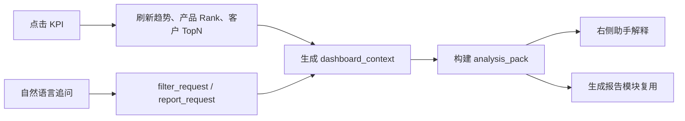

# OIC/MO 经营看板交互 Demo 与落地说明 v3

## 1. 本次迭代

本次在 v2 的 OIC 看板点击联动基础上，升级为“OIC/MO 经营看板 + 右侧 AI 助手”的一体化 Demo。

更新后的 HTML 文件：

- `oic_dashboard_interactive_demo.html`

本版重点补齐：

1. 顶部支持 OIC / MO 视角、日期、OIC 编号和币种筛选。
2. 主工作区支持 OIC / 团队 / 部门范围切换。
3. 四个 KPI 继续作为主控制器：存款、贷款、低息存款、非息收入。
4. 第二行联动 30 天趋势、按月趋势、产品 Rank。
5. 第三行联动客户 TopN，并新增“经营关注”区。
6. 右侧助手展示结构化上下文，模拟 `dashboard_context`。
7. 推荐动作覆盖分析原因、查看产品 Rank、查看 Top20 客户、生成 OIC 摘要。
8. 自然语言输入支持“只看贸易融资”“生成报告”等简单意图模拟。

## 2. 架构含义

Demo 不只是页面样式稿，而是用于说明三件事：

- 看板点击是更稳定的问数入口，因为指标、日期、OIC、产品、客户都已经在界面上确定。
- 右侧助手不负责猜测点击行为，只读取前端传入的 `dashboard_context`。
- 看板解释和生成报告应共用 `analysis_pack`，避免重复取数和重复计算。

## 3. 交互链路



## 4. 正式开发替换点

当前 HTML 使用前端模拟数据。正式开发时建议替换以下部分：

| Demo 部分 | 正式能力 |
| --- | --- |
| 内置 `DATA` | MMP/OIC 指标服务 |
| 前端模拟趋势 | `get_oic_metric_trend` |
| 前端产品数组 | `get_oic_product_rank` + `dim_metric_product_mapping` |
| 前端客户数组 | `get_oic_customer_topn` + 权限审计 |
| 前端模拟分析 | `build_oic_analysis_pack` + 模型解释 |
| 生成报告按钮 | 生成报告模块消费当前 `analysis_pack` |

## 5. 推荐接口

```json
{
  "tool": "get_oic_dashboard_overview",
  "params": {
    "date": "2026-05-05",
    "scope": "OIC",
    "oic_id": "EE001408023",
    "metrics": ["DEP_BAL", "LOAN_BAL", "LOW_COST_DEP", "NON_INTEREST_INCOME"]
  }
}
```

```json
{
  "tool": "build_oic_analysis_pack",
  "params": {
    "date": "2026-05-05",
    "scope": "OIC",
    "oic_id": "EE001408023",
    "metric_code": "LOAN_BAL",
    "product_code": "MA_M111_8",
    "ci_id": null,
    "include": ["overview", "trend", "monthly_trend", "product_rank", "customer_topn", "alerts", "evidence"]
  }
}
```

## 6. 验收重点

- 点击 KPI 后，趋势、产品 Rank、客户 TopN、右侧上下文同步变化。
- 点击产品后，客户 TopN 进入产品上下文。
- 点击客户后，右侧助手进入客户贡献上下文。
- “生成报告”动作不重新取数，而是复用当前分析包。
- 表格列名保留比较口径，避免同比、环比、较上月混用。
- 客户 TopN 和导出明细必须进入权限审计。

## 7. 与 v2 的差异

v2 更偏 OIC 单页联动演示；v3 进一步把它扩展成经营入口原型：

- 增加 MO / OIC 视角概念。
- 增加范围切换和经营关注。
- 更明确地区分 `dashboard_context`、`filter_request`、`analysis_pack`。
- 将“右侧助手”定位为解释和动作编排层，而不是取数层。
